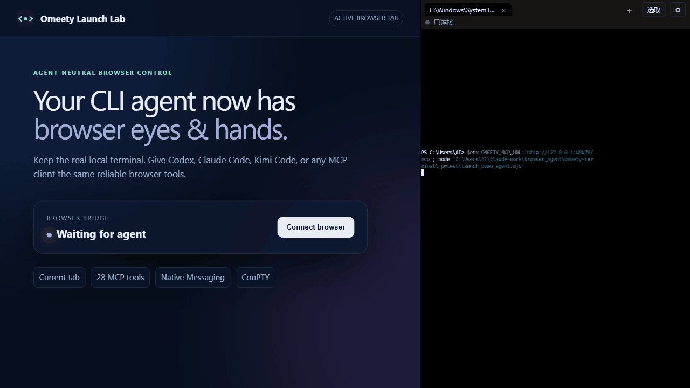

# Omeety Terminal

**简体中文** | [English](README.en.md)

[](https://github.com/littlejoely/omeety-terminal/releases)
[](LICENSE)
[](#已知限制--安全)
[](#mcp-工具41-个)

**Omeety Terminal 是 CLI Agent 的浏览器外骨骼：把真实本地终端放进
Edge/Chrome 侧栏，让 Codex、Claude Code、Kimi Code 以及任何支持 MCP 的
CLI Agent 共用当前网页的同一双眼睛和手。**

[3 分钟快速开始](#3-分钟快速开始) · [为什么是 Omeety](#为什么是-omeety) ·
[工作原理](#它怎么工作一张图) · [41 个 MCP 工具](#mcp-工具41-个) ·
[安全边界](#已知限制--安全) · [参与开发](CONTRIBUTING.md)



> 上面的可复现演示使用确定性的本地 MCP 客户端，实际经过扩展、Native
> Messaging、ConPTY 和浏览器工具；Codex、Claude Code、Kimi Code 使用同一套
> 41 个工具。演示不依赖模型账号或预录的模型回答。

没有专用聊天模式，也没有模型切换按钮——它就是一个真实 shell。你仍然可以运行
`git`、`npm`、`claude`、`codex`、`kimi` 或任意本地命令；区别是里面的 Agent
自动获得了当前浏览器标签页的感知和操作能力。

这是一个独立开发的 Windows/macOS Beta 项目，不是 OpenAI、Anthropic、Moonshot AI、
Microsoft 或 xterm.js 的官方产品。

## 为什么是 Omeety

| 能力 | Omeety Terminal | 常见独立 Browser MCP | 集成式桌面 Agent |
|---|:---:|:---:|:---:|
| 操作你正在使用、已经登录的浏览器标签页 | ✅ | 视实现而定 | 视产品而定 |
| 真实本地 PTY / 普通 Shell | ✅ | — | 通常不是 |
| Codex、Claude Code、Kimi Code 共用一套能力 | ✅ | 部分支持 | 通常绑定自家 Agent |
| Agent / 模型中立的 MCP 工具契约 | ✅ | ✅ | 通常不是 |
| 页面元素选取、截图、Console、真实 CDP 输入 | ✅ | 视实现而定 | 视产品而定 |
| 持久化下载、断点续传、代理择路与 SHA-256 校验 | ✅ | 通常没有 | 视产品而定 |
| 本地桥接；MCP 仅监听 `127.0.0.1` | ✅ | 视实现而定 | 视产品而定 |
| 提交、删除、保存等危险操作保留确认 | ✅ | 视实现而定 | 视产品而定 |

## 3 分钟快速开始

当前版本已在 **Windows 11 + Microsoft Edge** 和 **macOS + Google Chrome** 验证。先安装 Node.js LTS，以及
你准备使用的 `codex`、`claude` 或 `kimi` CLI。

macOS：

```bash
git clone https://github.com/littlejoely/omeety-terminal.git
cd omeety-terminal
./installer/install.sh
```

Windows：

```powershell
git clone https://github.com/littlejoely/omeety-terminal.git
cd omeety-terminal
powershell -ExecutionPolicy Bypass -File installer\install.ps1
```

然后：

1. 打开 `chrome://extensions` 或 `edge://extensions` → 开启开发者模式 → **加载已解压的扩展**。
2. 选择仓库里的 `extension` 文件夹。
3. 点击 Omeety 图标打开侧栏，在真实终端里运行 `codex`、`claude` 或 `kimi`。
4. 对 Agent 说：**“描述当前网页”**；或点侧栏的**选取**，连续点多个元素，
   按 Enter/点「完成选取」，上下文会自动写进当前 Agent 输入框。

需要完整安装原理、配置位置和卸载步骤，请继续阅读下文。

> **不想 clone、或网络受限？** 到 [Releases](https://github.com/littlejoely/omeety-terminal/releases/latest)
> 下载 `omeety-terminal.zip`（已含全部依赖），解压后在项目根目录同样跑
> `installer\install.ps1`（Windows）或 `./installer/install.sh`（macOS）即可，
> 无需 `npm install`，也无需联网拉依赖。

维护者生成离线包时必须使用白名单打包器，不要直接压缩工作区：

```powershell
Set-Location host
npm run package:release
```

产物位于 `dist/omeety-terminal-v<版本>-offline.zip`，同时生成归档 SHA-256；
压缩包内的 `PACKAGE-MANIFEST.json` 记录每个文件的大小和 SHA-256。打包器只复制
明确审查过的运行文件，并在全新临时目录中按 lockfile 安装生产依赖，因此不会带入
浏览器 Profile、日志、本地配置、密钥或备份。

## 产品定位：Agent 的浏览器外骨骼

可以把 LLM 理解为操控者，把 Codex、Claude Code、Kimi Code 等 CLI Agent
理解为各有特长的战甲；**Omeety 是套在这些 Agent 外面的浏览器外骨骼**：
它不替代里面的 Agent，而是为任意“模型 + Agent”组合提供同一双浏览器眼睛、
同一双手和一条真实终端通道。

换一种说法，Omeety 是一套**兼容不同赛车和车手的浏览器赛道遥测与操作系统**。
它不绑定 GPT、Claude、GLM、Kimi 或某一家 CLI，也不要求它们为 Omeety 做专门
适配；支持 MCP 的 Agent 都应能复用同一套浏览器能力。

这也决定了项目的开发原则：

- **Agent 中立**：浏览器能力走开放协议和稳定工具契约，不把能力锁进某个模型或 CLI。
- **保持终端纯粹**：核心仍是真 PTY + xterm.js，不在侧栏里另造聊天 Agent、文件树或完整 IDE。
- **做强眼睛和手脚**：优先提高页面感知、元素定位、真实输入、跨导航操作、截图和上下文交接的可靠性。
- **本地优先、权限可见**：终端拥有本机用户权限；浏览器操作在本机桥接，危险动作保留确认边界。
- **渐进增强**：Agent 即使不认识 Omeety 的 UI，也能只凭 MCP 工具工作；高级能力应当可选，不破坏普通 shell。

### 给 Clone / Fork 的二开方向

推荐围绕“外骨骼”继续扩展，而不是把核心变成另一个封闭 Agent：

1. 完善 PTY、键盘、IME、渲染和会话恢复，让它更接近系统终端。
2. 增强浏览器遥测（DOM、Console、Network、截图）以及稳定、可审计的操作能力。
3. 将选取元素、页面片段和图片组合成标准 Context Bundle，交给不同 CLI Agent。
4. 为更多 MCP Agent、浏览器和操作系统增加薄适配层，保持核心工具契约一致。
5. 把权限组、只读模式、域名边界等做成可选安全层，而不是绑定某个模型的策略。

当前第一优先级是**可靠性与可测性能**：终端输入输出和浏览器工具必须做到“结果
真实、错误可信、页面跳转不中断”，并用真实 PTY/WebGL 基准防止资源与吞吐回退。
连续选取、Context Bundle v1、Browser Core v2、跨域 iframe 深度观察和动作后验证已经
落地；下一阶段会继续完善更细粒度的网络遥测。

## 它怎么工作（一张图）

```
扩展侧栏 [ xterm.js 终端 ]  ←─ native messaging ─→  本地 host（Node，一个进程）
                                                         ├─ PTY：真实 shell，I/O 桥到终端
                                                         ├─ Browser Core：目标、权限、事务、指标与审计
                                                         ├─ 下载核心：任务状态、分块、校验、原子落盘
                                                         └─ MCP Streamable HTTP @ http://127.0.0.1:49171/mcp
                                                               ↑ claude/codex/kimi 用各自配置连它
                                                         浏览器工具 → Browser Adapter/CDP + content.js
                                                         下载工具 → host 本地核心
```

- 首次打开终端面板时，浏览器拉起 host；之后 offscreen 按设置保活 host/PTY（持续保活、空闲 30 分钟或立即结束）。
- 重新打开侧栏会从 host 获取真实会话清单，恢复全部仍在运行的终端 Tab，并回放有限的近期输出。
- Browser Core 在 Host 内统一目标、权限和高层工具；扩展侧 Browser Adapter 递归观察跨进程 iframe/worker，不额外启动常驻后端。
- 同一个本地进程承载终端 I/O、PTY、Browser Core、下载核心与 MCP 服务。

## ⚠ 前置：必须有一个本地 host

纯浏览器扩展**不能**启动本地程序。所以这个终端需要一个一次性的本地 native messaging host（Node）。安装器会自动装好，**不需要**像旧版 Codeg 那样常驻服务/Token/握手。

需要：**Node.js（建议 LTS）** 已安装。已装的 `claude` / `codex` / `kimi` 会被自动配上浏览器工具。

## 完整安装说明

### macOS（Chrome）

```bash
# 请在 macOS 自带 Terminal / iTerm 中，从项目根目录执行
./installer/install.sh
```

如果 macOS 询问是否允许 `node` 使用开发者工具，请选择**允许**；拒绝后
`node-pty` 原生模块将无法加载，可在“系统设置 → 隐私与安全性 → 开发者工具”中重新允许。

### Windows（Edge / Chrome）

```powershell
# 在项目根目录
powershell -ExecutionPolicy Bypass -File installer\install.ps1
```

安装器会：
1. 给 host 装 npm 依赖（`node-pty` / MCP SDK / express / undici）。
2. 生成 `host/host-manifest.json`；Windows 注册到 HKCU，macOS 安装到浏览器用户级 `NativeMessagingHosts` 目录，均不需要管理员权限。
3. 把 MCP（`http://127.0.0.1:49171/mcp`）写进 `claude`、`codex`、`kimi` 的配置（先备份成 `*.bak-时间戳`）。

> 扩展 ID 由 `manifest.json` 的 `key` 固定为 `fjhjkmpldbepgcpfkhpolnnheccjaamg`，所以注册表的 `allowed_origins` 跨重载/换机稳定。

然后加载扩展：
1. `chrome://extensions`（或 `edge://extensions`）→ 打开**开发者模式**。
2. **加载已解压的扩展** → 选择项目中的 `extension` 目录。
3. 确认扩展 ID = `fjhjkmpldbepgcpfkhpolnnheccjaamg`。

## 使用

1. 点扩展图标开侧栏 → 首次有"真·终端=整机权限"的确认门，点「我了解」。
2. 出现系统 Shell 提示符（Windows 为 PowerShell，macOS 为 zsh）。敲 `claude`（或 `codex` / `kimi`）。
3. 在 agent 里：
   - `/mcp`（claude）能看到 `omeety_terminal` + 41 个 `omeety_*` 工具已连上。
   - 让它"描述当前网页" → 它会读取你**当前 Chrome/Edge 标签页**的内容。
4. 设置（⚙）：可切换 Shell、调整每个 Tab 的回滚行数、配置会话保活，并选择浏览器权限模式。

## 常见使用场景

装好之后，用自然语言让 Agent 指挥浏览器——以下是典型玩法：

| 场景 | 你可以这样对 Agent 说 |
|---|---|
| **网页 IM 自动化** | “把这份周报发到飞书 / 钉钉的 XX 群，附件也一起发” |
| **表单批量填写** | “照这个 Excel 把报销单 / 审批单逐条填好提交” |
| **网页数据抓取** | “把这个列表每一页的商品名和价格读出来，存成本地 csv” |
| **跨网站自动化** | “登录 A 站导出本月数据，再上传到 B 站，完事发个通知” |
| **本地 × 浏览器联动** | “把网页上这份表格抓下来存本地，再把本地这份名单填回去” |

> 遇到**没有文字的图标按钮**（IM、复杂后台里很常见），Agent 难分清谁是谁。
> 点侧栏「**选取**」进入拾取模式，在网页上点哪个元素，它就被框选、编号并喂给 Agent，
> 之后操作就精准了。支持连续选取多个元素（Enter 或「完成选取」结束，结果以 `pick-1…N` 写入当前输入框，不会自动回车）。

## 终端快捷键 / 特性

- **Ctrl+F**：终端内搜索输出（Enter 下一个 / Shift+Enter 上一个 / Esc 关闭）。
- **Ctrl+点击链接**：在浏览器新标签页打开终端里的 URL。
- **选中即复制**；**Ctrl+V / Cmd+V / 右键粘贴**（bracketed paste：长内容可由 Codex 折叠，多行粘进 claude/PSReadLine 不会逐行提交）。
- **Ctrl+滚轮 / Ctrl+= / Ctrl+- / Ctrl+0**：调字号（自动记住，重开不丢）。
- **Ctrl+Alt+T** 新终端 tab · **Ctrl+Alt+W** 关闭当前 · **Ctrl+Alt+←/→** 切换 tab（Ctrl+T/W/Tab 被浏览器占用，故用 Ctrl+Alt）。
- tab 栏：点击切换、**中键关闭**、右键重命名；shell 上报的窗口标题（cmd `title`、PS `$Host.UI.RawUI.WindowTitle`）自动变成 tab 标题。
- 多 Tab 只让当前活动终端占用 WebGL Renderer；后台 Tab 继续运行和接收输出，但释放 GPU 渲染资源，切回时自动恢复。
- 侧栏重开会恢复全部仍存活的终端 Tab；设置中可选择持续保活、空闲 30 分钟后结束或关闭侧栏立即结束。
- **OSC52**：shell 里的程序（claude `/copy`、tmux、vim）可直接写系统剪贴板。
- 终端声明 `xterm-256color` 与 True Color 能力，Codex/Claude/Kimi 可正常显示彩色 TUI。
- **连续选取**：点「选取」后在网页连续点选（再次点击可取消该项），按 Enter 或点
  「完成选取」结束；`pick-1…N` 稳定引用和简洁摘要会写入当前终端输入行，且不会自动回车执行。

## MCP 工具（41 个）

其中 38 个是浏览器眼睛与双手，3 个是 MCP-first 的本地下载工具；Codex、Claude
Code、Kimi Code 等 Agent 自动使用同一套工具契约。

### Browser Core 高层工具（7 个）

`omeety_browser_observe`、`omeety_browser_query`、`omeety_browser_act`、
`omeety_browser_transaction`、`omeety_browser_wait`、`omeety_browser_tabs` 和
`omeety_browser_status` 提供稳定的统一入口。它们负责锁定目标、权限检查、动作后验证、
自动恢复、指标与脱敏审计；原有工具继续保留，因此现有 Agent 提示词和调用方式无需迁移。

深度观察会合并主文档与跨进程 iframe 的 DOMSnapshot、Accessibility Tree 和 Frame
拓扑。页面重渲染导致旧 `uN` 失效时，复合定位器会按角色、标签、文本、属性、父节点与
位置重新定位；歧义结果不会盲点。

默认观察使用 compact 快照，去掉重复的长 CSS 路径；查询会把命中的纯文本自动提升到
最近的可点击父容器。动作结果区分 `dispatched`（事件已发出）、`applied`（后置条件成立）
和 `committed`（刷新后仍成立）。需要确认服务端已保存时，在 `expect` 中传
`persistAfterReload:true`。`press_key` 支持 `Meta/Control/Alt/Shift` 组合键；显式指定
非活动 `tabId` 的截图由 CDP 捕获，不会误截当前标签页。

### 浏览器底层工具（31 个）

**查看 / 获取**：`omeety_get_context_bundle`（结构化元素上下文 + 局部截图）、`omeety_get_page_snapshot`（稳定 uid + 增量快照）、`omeety_get_selected_context`、`omeety_capture_visible_tab`、`omeety_fetch_with_cookie`、`omeety_get_user_pick`、`omeety_get_user_picks`（连续选取的 `pick-1…N`）、`omeety_list_tabs`、`omeety_get_console_logs`、`omeety_get_runtime_metrics`。

**操作**：`omeety_act_and_verify`（动作 + 后置条件验证事务）、`omeety_click`、`omeety_click_text`、`omeety_click_at`、`omeety_fill`、`omeety_type_text`、`omeety_press_key`、`omeety_select`、`omeety_scroll`、`omeety_hover`、`omeety_upload_file`、`omeety_open_tab`、`omeety_switch_tab`、`omeety_navigate`、`omeety_reload`、`omeety_go_back`、`omeety_close_tab`、`omeety_wait_for`、`omeety_execute_js`、`omeety_apply_preview_patch`、`omeety_rollback_preview_patch`、`omeety_request_user_confirmation`。

危险操作（提交/保存/删除/同意类点击、非 GET 请求）会自动弹浏览器确认框，需你同意才执行。富文本编辑器（飞书等）合成事件不认时，给 `click_at`/`fill`/`type_text`/`press_key` 传 `cdp:true` 走真实输入。

Canvas/受控表格的数字单元格可以先用 `click_at` 的 `clickCount:2` 进入编辑，再用
`type_text` 的 `cdp:true, inputMode:"keyEvents", refocus:false, commitKey:"Enter"`
在不重新点击瞬时隐藏输入框的情况下替换并提交数值。清空会建立选区并读回验证，必要时按剩余长度回退，不再把只删一位误报为成功。

页面工具的结果会带回实际 `tabId`；长任务后续步骤建议复用并显式传入，这样用户中途切到其他标签页也不会改变操作目标，也无需额外调用 `list_tabs`。
`omeety_act_and_verify` 还可接收 1–20 个 `steps`，在一次 MCP 调用内串行执行点击、输入、
按键、等待、导航、刷新和 JavaScript 断言；默认首个语义失败即停止，并返回每步结果与耗时。
适合把原来十几次工具往返压缩成一次可审计事务。

### 本地下载工具（3 个，MCP-first）

- `omeety_download_start`：确认后创建持久化任务；自动探测直连/代理、按服务器能力并发分块、重试与断点续传，可选 SHA-256 校验。
- `omeety_download_status`：不传 `taskId` 时列出全部任务，传入后返回单个任务的进度、速度、ETA、线路与校验结果。
- `omeety_download_cancel`：取消任务并保留分块文件；下载内容永不自动执行。

CLI 只是这三个 MCP 工具的薄封装，Agent 与用户看到的是同一批任务：

```powershell
omeety download <URL> [--sha256 <校验值>] [--network auto|direct|proxy]
omeety download status [TASK_ID]
omeety download cancel <TASK_ID>
```

开始下载前，Omeety 会在侧栏显示来源、文件名、大小、线路、保存位置和校验信息，
必须由用户确认。任务由 Native Host 执行，关闭当前终端 tab 不会中断；退出浏览器或
Host 后任务会记为中断，并在下次 Host 成功启动后从已有分块继续。

## 常见问题

| 现象 | 处理 |
|---|---|
| 终端连不上（状态红点）| 重新运行当前系统的安装器（macOS：`install.sh`；Windows：`install.ps1`），确认扩展 ID 与 `allowed_origins` 一致、Node 已装 |
| `/mcp` 里没有 omeety_terminal | 重新运行安装器（会重写 agent 配置）；Codex 可用 `codex mcp add omeety_terminal --url http://127.0.0.1:49171/mcp` |
| codex/kimi 连不上 MCP | 确认配置 URL 是 `http://127.0.0.1:49171/mcp`；检查 `~/.codex/config.toml`、`~/.kimi-code/config.toml` |
| 终端里找不到 claude/codex/kimi | host 的 PATH 来自浏览器环境；用全路径运行，或把它们的目录加到系统 PATH 后重启浏览器 |
| `omeety download` 无法连接 | 先打开浏览器与 Omeety；CLI 是本机 MCP 的薄封装，Host 未运行时不会另起一套下载进程 |
| 关闭侧栏后再打开，少量旧输出没显示 | 会话仍在运行，但只回放最近 64KB 输出；继续输入即可，完整历史应由终端程序自身保存 |
| 多终端 Tab 占用偏高 | 在设置中把“终端回滚行数”调为 3,000 或 5,000；Omeety 只为活动 Tab 保留 WebGL Renderer |
| `execute_js` 后出现浏览器调试提示条 | 该工具为兼容严格 CSP 使用 CDP；这是 Chromium 对 `debugger` 权限的可见提示，不影响普通终端 |
| 浏览器报「无法与原生消息宿主通信」(-101) | 安装路径含中文或空格。把整个项目目录移到**纯英文、无空格**路径（如 `C:\omeety-terminal`），重跑安装器 |
| 加载扩展报错 / 选目录没反应 | 要选项目里的 **`extension` 文件夹**（里面要有 `manifest.json`），不是项目根目录、也不是 zip 包 |
| `install.ps1` 报执行策略 / 未签名 | 加 `-ExecutionPolicy Bypass` 参数即可，只对本次运行生效，不改系统策略 |

## 卸载

macOS：

```bash
./installer/uninstall.sh
```

Windows：

```powershell
powershell -ExecutionPolicy Bypass -File installer\uninstall.ps1
```
移除 Native Messaging 注册 + 从各 Agent 配置删除 `omeety_terminal`（备份保留）。然后到浏览器扩展管理页移除扩展。

## 目录

```
extension/    MV3 扩展（终端 + native 端口 + content 工具）
host/         native messaging host（PTY + MCP Streamable HTTP，兼容 legacy SSE）
installer/    Windows PowerShell 与 macOS zsh 安装/卸载脚本
shared/       协议说明
tools/        gen-key.js（生成扩展 key + 固定 ID）
_test/        mock-native 冒烟测试（无需浏览器）
_pwtest/      有头 Edge 回归探针（仅提交可公开复现脚本）
```

开发回归统一从 `host` 目录运行：

```bash
cd host
npm test
```

测试包含 30 秒硬超时和 Host/PTY 退出清理，不需要注册常驻 `launchctl` 任务。Host 调试日志按
`20MB × 3份` 轮转，并跳过心跳消息，最多约占 60MB。

## 已知限制 / 安全

- **真终端 = 整机权限**：这是固有特性。host 的 MCP 只 bind `127.0.0.1`（不对外）；危险浏览器操作仍走页面内确认框。
- **下载必须确认且永不执行**：下载前在侧栏确认，文件只写入配置的 Downloads 目录；可执行文件会明确标记，Omeety 不会启动它。
- 侧栏关闭后是否保活由设置决定，并只缓存最近 64KB 输出；退出浏览器、重载扩展、native host 崩溃或被系统回收仍会结束会话。
- 已验证 Windows ConPTY 与 macOS Chrome + zsh PTY；Linux 尚未完成浏览器真机回归。
- Safari 当前不受支持：Safari 没有 Chromium `sidePanel`、`offscreen`、`chrome.debugger/CDP` 的等价组合，并且其 Native Messaging 必须通过包含扩展的 macOS App。Safari 版需要独立容器 App 和浏览器适配层，不能直接加载本目录。
- Codex 在浏览器侧栏终端中的光标/中文 IME 兼容性跟踪：
  [openai/codex#35438](https://github.com/openai/codex/issues/35438)。
- 除 `docs/images` 中经审查的公开图片外，本地私钥、浏览器 Profile、日志、
  调试截图和安装器生成文件均不会提交；详见
  [`SECURITY.md`](SECURITY.md)。

## 开源协议

Omeety Terminal 使用 [MIT License](LICENSE) 开源。项目包含的第三方组件保留
各自的版权和许可声明，详见 [`THIRD_PARTY_NOTICES.md`](THIRD_PARTY_NOTICES.md)。

如果 Omeety 的确帮你减少了浏览器与工具之间的切换，欢迎给仓库一个 Star。
Bug 报告和范围清晰的 Pull Request 也都欢迎，参与方式见
[`CONTRIBUTING.md`](CONTRIBUTING.md)。
