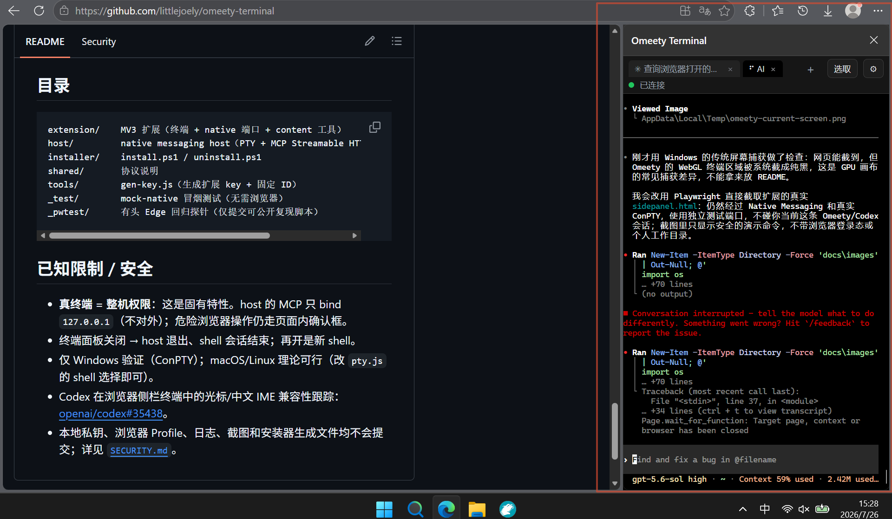

# Omeety Terminal

**简体中文** | [English](README.en.md)

浏览器（Edge/Chrome）侧栏里的**真·终端**，并且**预接浏览器操控 MCP**：在里面敲 `claude` / `codex` / `kimi`（或任何支持 MCP 的 CLI），它们就**自动能看见并操作你当前打开的网页**。

这是一个自行开发的实验性项目，不是 OpenAI、Anthropic、Moonshot AI、
Microsoft 或 xterm.js 的官方产品。



没有切换按钮——它就是个真实 shell（PowerShell/cmd/自定义），想跑啥敲啥（`git`、`npm`、`claude`、`codex`、`kimi`…）。浏览器工具在安装时一次性写进各 AI 的配置，所以"开箱即用"。

## 它怎么工作（一张图）

```
扩展侧栏 [ xterm.js 终端 ]  ←─ native messaging ─→  本地 host（Node，一个进程）
                                                        ├─ PTY：真实 shell，I/O 桥到终端
                                                        └─ MCP Streamable HTTP @ http://127.0.0.1:49171/mcp
                                                               ↑ claude/codex/kimi 用各自配置连它
                                                         工具调用 → 转发到 content.js（操控当前标签页）
```

- host 只在**终端面板打开时**由浏览器拉起运行；关掉面板 = host 退出。
- 一个进程干三件事：终端 I/O 中继、PTY（真 shell）、MCP 服务。

## ⚠ 前置：必须有一个本地 host

纯浏览器扩展**不能**启动本地程序。所以这个终端需要一个一次性的本地 native messaging host（Node）。安装器会自动装好，**不需要**像旧版 Codeg 那样常驻服务/Token/握手。

需要：**Node.js（建议 LTS）** 已安装。已装的 `claude` / `codex` / `kimi` 会被自动配上浏览器工具。

## 安装（一次性）

```powershell
# 在项目根目录
powershell -ExecutionPolicy Bypass -File installer\install.ps1
```

安装器会：
1. 给 host 装 npm 依赖（`node-pty` / MCP SDK / express）。
2. 生成 `host/host-manifest.json`，注册到注册表（Edge + Chrome，HKCU，免管理员）。
3. 把 MCP（`http://127.0.0.1:49171/mcp`）写进 `claude`、`codex`、`kimi` 的配置（先备份成 `*.bak-时间戳`）。

> 扩展 ID 由 `manifest.json` 的 `key` 固定为 `fjhjkmpldbepgcpfkhpolnnheccjaamg`，所以注册表的 `allowed_origins` 跨重载/换机稳定。

然后加载扩展：
1. `edge://extensions`（或 `chrome://extensions`）→ 打开**开发者模式**。
2. **加载已解压的扩展** → 选 `omeety-terminal\extension`。
3. 确认扩展 ID = `fjhjkmpldbepgcpfkhpolnnheccjaamg`。

## 使用

1. 点扩展图标开侧栏 → 首次有"真·终端=整机权限"的确认门，点「我了解」。
2. 出现 PowerShell 提示符。敲 `claude`（或 `codex` / `kimi`）。
3. 在 agent 里：
   - `/mcp`（claude）能看到 `omeety_terminal` + 28 个 `omeety_*` 工具已连上。
   - 让它"描述当前网页" → 它会读取你**当前 Edge 标签页**的内容。
4. 设置（⚙）：可切 shell（PowerShell / CMD / pwsh / Git Bash / 自定义路径）。

## 终端快捷键 / 特性

- **Ctrl+F**：终端内搜索输出（Enter 下一个 / Shift+Enter 上一个 / Esc 关闭）。
- **Ctrl+点击链接**：在浏览器新标签页打开终端里的 URL。
- **选中即复制**；**Ctrl+V / 右键粘贴**（bracketed paste：多行粘进 claude/PSReadLine 不会逐行提交）。
- **Ctrl+滚轮 / Ctrl+= / Ctrl+- / Ctrl+0**：调字号（自动记住，重开不丢）。
- **Ctrl+Alt+T** 新终端 tab · **Ctrl+Alt+W** 关闭当前 · **Ctrl+Alt+←/→** 切换 tab（Ctrl+T/W/Tab 被浏览器占用，故用 Ctrl+Alt）。
- tab 栏：点击切换、**中键关闭**、右键重命名；shell 上报的窗口标题（cmd `title`、PS `$Host.UI.RawUI.WindowTitle`）自动变成 tab 标题。
- **OSC52**：shell 里的程序（claude `/copy`、tmux、vim）可直接写系统剪贴板。

## 支持的浏览器工具（28 个，agent 自动可用）

**查看 / 获取**：`omeety_get_page_snapshot`（元素 uid 跨快照稳定）、`omeety_get_selected_context`、`omeety_capture_visible_tab`（截图，1280 宽自适应下采样）、`omeety_fetch_with_cookie`、`omeety_get_user_pick`（侧栏 📌 选取的元素）、`omeety_list_tabs`、`omeety_get_console_logs`（CDP 收 console/异常）。

**操作**：`omeety_click`、`omeety_click_text`、`omeety_click_at`、`omeety_fill`、`omeety_type_text`、`omeety_press_key`、`omeety_select`、`omeety_scroll`、`omeety_hover`、`omeety_upload_file`、`omeety_open_tab`、`omeety_switch_tab`、`omeety_navigate`、`omeety_reload`、`omeety_go_back`、`omeety_close_tab`、`omeety_wait_for`（等元素/文本出现，代替瞎等）、`omeety_execute_js`（页面 MAIN world 执行任意 JS 的逃生舱）、`omeety_apply_preview_patch`、`omeety_rollback_preview_patch`、`omeety_request_user_confirmation`。

危险操作（提交/保存/删除/同意类点击、非 GET 请求）会自动弹浏览器确认框，需你同意才执行。富文本编辑器（飞书等）合成事件不认时，给 `click_at`/`fill`/`type_text`/`press_key` 传 `cdp:true` 走真实输入。

## 常见问题

| 现象 | 处理 |
|---|---|
| 终端连不上（状态红点）| 确认 `install.ps1` 跑过、扩展 ID 与注册表 `allowed_origins` 一致、Node 已装 |
| `/mcp` 里没有 omeety_terminal | 重新运行 `install.ps1`（会重写 agent 配置）；Codex 可用 `codex mcp add omeety_terminal --url http://127.0.0.1:49171/mcp` |
| codex/kimi 连不上 MCP | 确认配置 URL 是 `http://127.0.0.1:49171/mcp`；检查 `~/.codex/config.toml`、`~/.kimi-code/config.toml` |
| 终端里找不到 claude/codex/kimi | host 的 PATH 来自浏览器环境；用全路径运行，或把它们的目录加到系统 PATH 后重启浏览器 |
| 截图/工具调用偶发失败 | 终端面板要保持打开（关了 host 就退了） |

## 卸载

```powershell
powershell -ExecutionPolicy Bypass -File installer\uninstall.ps1
```
移除注册表项 + 从各 agent 配置删除 `omeety_terminal`（备份保留）。然后到 `edge://extensions` 移除扩展。

## 目录

```
extension/    MV3 扩展（终端 + native 端口 + content 工具）
host/         native messaging host（PTY + MCP Streamable HTTP，兼容 legacy SSE）
installer/    install.ps1 / uninstall.ps1
shared/       协议说明
tools/        gen-key.js（生成扩展 key + 固定 ID）
_test/        mock-native 冒烟测试（无需浏览器）
_pwtest/      有头 Edge 回归探针（仅提交可公开复现脚本）
```

## 已知限制 / 安全

- **真终端 = 整机权限**：这是固有特性。host 的 MCP 只 bind `127.0.0.1`（不对外）；危险浏览器操作仍走页面内确认框。
- 终端面板关闭 → host 退出、shell 会话结束；再开是新 shell。
- 仅 Windows 验证（ConPTY）；macOS/Linux 理论可行（改 `pty.js` 的 shell 选择即可）。
- Codex 在浏览器侧栏终端中的光标/中文 IME 兼容性跟踪：
  [openai/codex#35438](https://github.com/openai/codex/issues/35438)。
- 除 `docs/images` 中经审查的公开图片外，本地私钥、浏览器 Profile、日志、
  调试截图和安装器生成文件均不会提交；详见
  [`SECURITY.md`](SECURITY.md)。

## 开源协议

Omeety Terminal 使用 [MIT License](LICENSE) 开源。项目包含的第三方组件保留
各自的版权和许可声明，详见 [`THIRD_PARTY_NOTICES.md`](THIRD_PARTY_NOTICES.md)。
